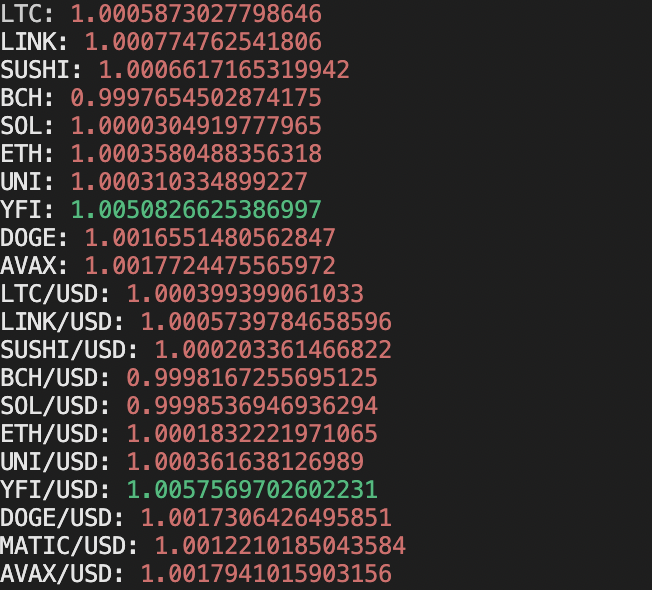

# alpaca_py 

This project displays the profitability of triangular arbitrage opportunities for all the tokens listed on Alpaca.

The output of triangle.py. Values represent the profit multiple of the corresponding trade, where green means >1.024 and red = less than 1.024. 